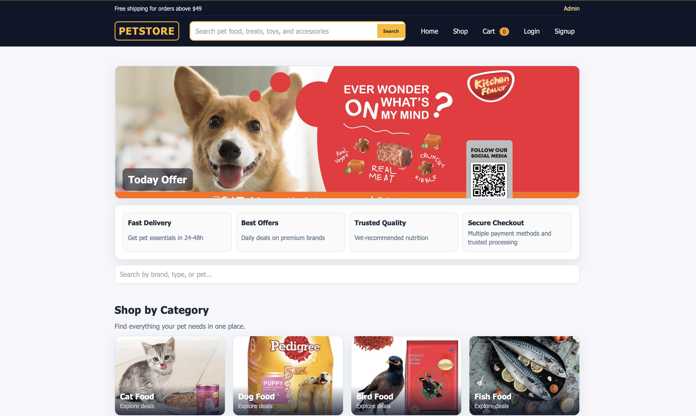
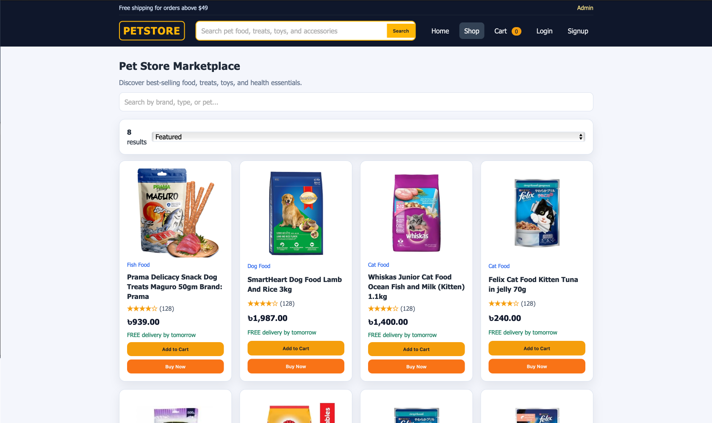
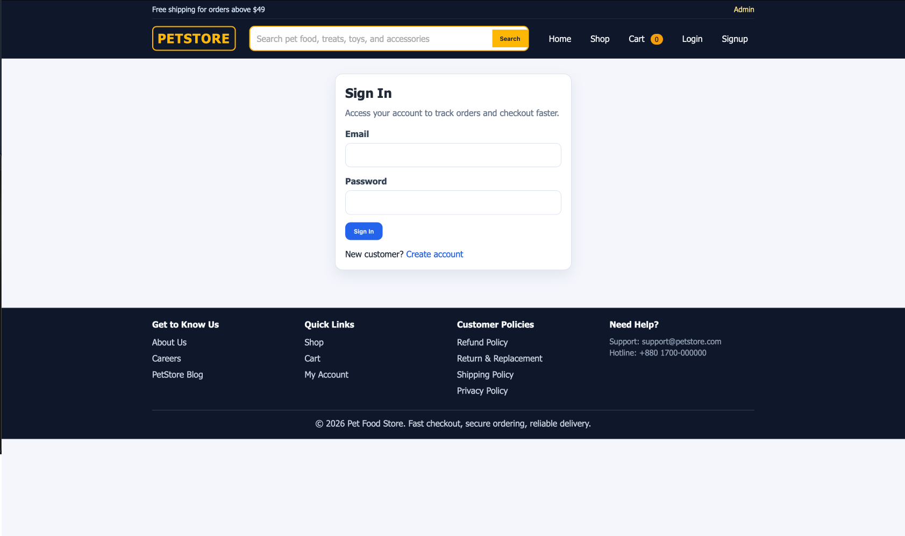
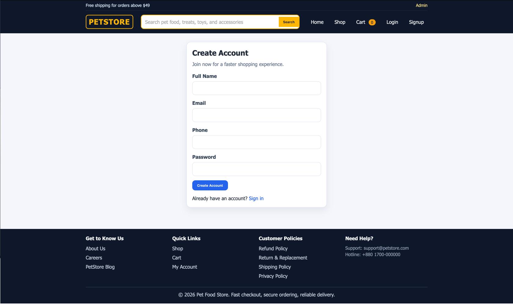
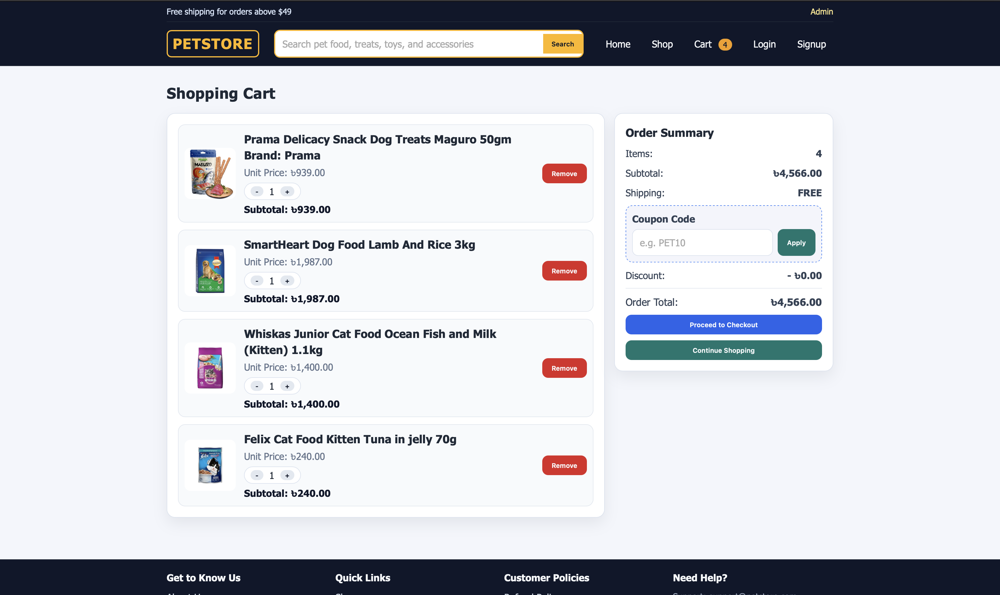
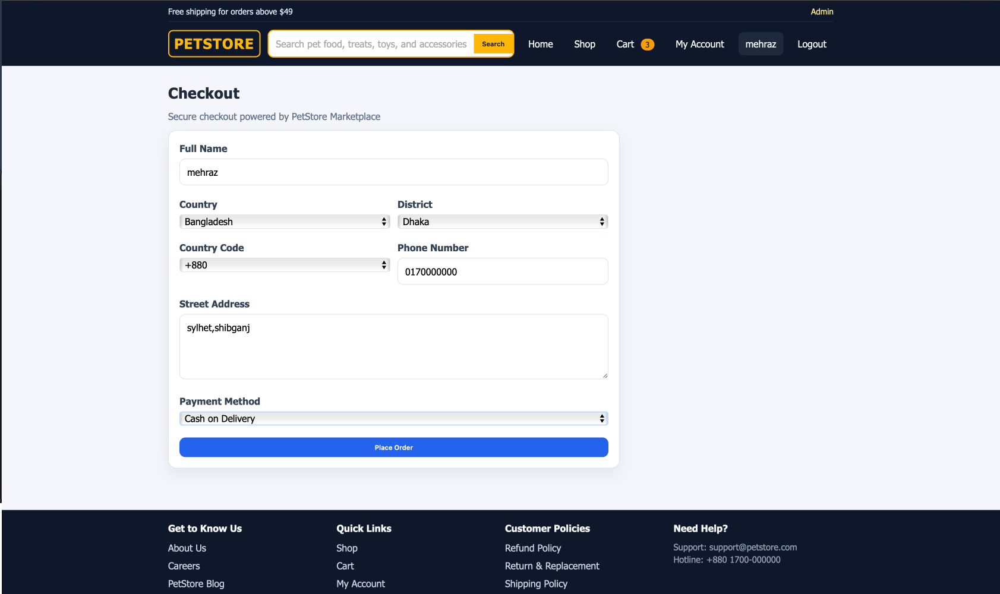
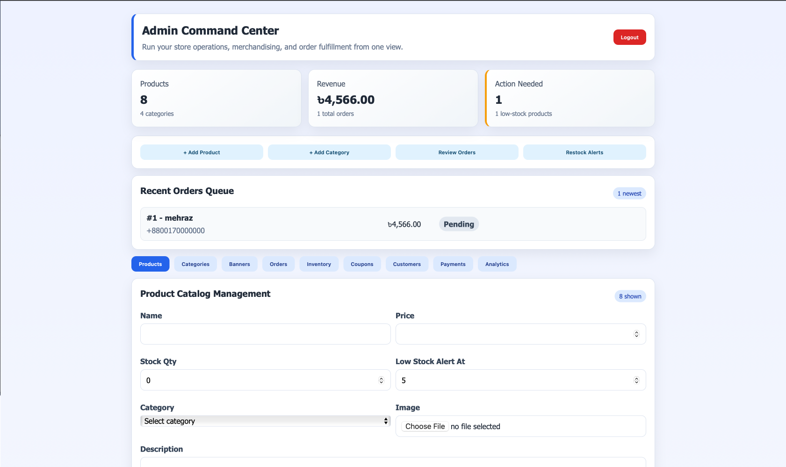
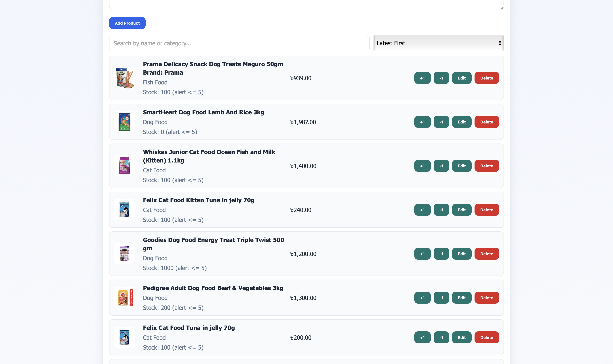
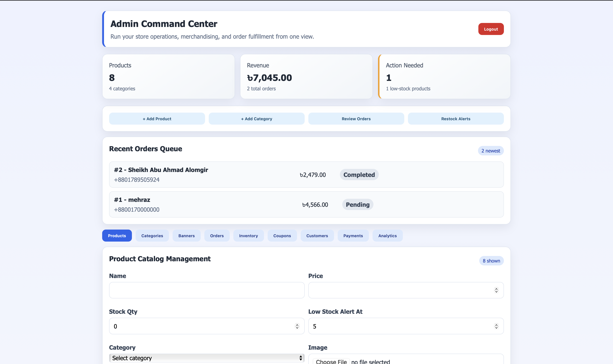

````markdown
# Pet Food Store

A full-stack web-based e-commerce application for browsing, managing, and purchasing pet products. The system includes a modern customer storefront and a secure administrative dashboard for handling products, categories, coupons, sliders, payment methods, and orders.

---

## Project Overview

**Pet Food Store** is a complete e-commerce platform developed as an academic full-stack web application project. It is designed to provide customers with an easy online shopping experience for pet-related products, while administrators can efficiently manage store operations from a protected dashboard.

The project demonstrates important web development concepts such as:

- full-stack application architecture
- authentication and role-based access control
- product and category management
- cart and checkout workflow
- order processing
- relational database design
- modern frontend-backend integration

---

## Academic Information

**Course:** SWE-382: Project on Web App Development  
**Department:** Software Engineering  
**University:** Metropolitan University  

### Submitted By

1. **Khandokar Ahmed Maharaz** — `221-134-031`  
2. **Sheakh Abu Ahmad Alomgir** — `221-134-029`

---

## Live Demo

**Live Site:** `https://your-live-site-link.com`

---

## GitHub Repository

**Repository:** `https://github.com/your-username/your-repository`

---

## Documentation

Detailed project documentation is included in the repository.

**Recommended file path:**

```bash
/docs/Pet_Food_Store_Documentation.pdf
````

If you want, you can also keep the LaTeX source inside:

```bash
/docs/latex-source/
```

---

## Key Features

### Customer Side

* user registration and login
* secure session-based authentication
* product browsing and category filtering
* product details page
* add to cart and update cart
* coupon application
* checkout system
* order placement
* order history and tracking
* profile management

### Admin Side

* admin login and protected dashboard
* product management
* category management
* coupon management
* homepage slider management
* payment method management
* order management and status updates

---

## Technology Stack

### Frontend

* Vue 3
* Vue Router
* Axios
* Vite

### Backend

* PHP
* Custom MVC-style architecture

### Database

* MySQL

### Server / Deployment

* Apache
* `.htaccess`

### Version Control

* Git
* GitHub

---

## System Modules

The project is divided into the following major modules:

* Home page
* Product listing
* Category browsing
* Authentication module
* Shopping cart
* Coupon system
* Checkout module
* Order management
* User profile
* Admin dashboard
* Product administration
* Category administration
* Payment method administration
* Slider administration

---

## Project Structure

```bash
pet-food-store/
├── backend/
│   ├── core/
│   ├── controllers/
│   ├── models/
│   ├── middleware/
│   ├── routes/
│   └── config/
│
├── frontend/
│   ├── src/
│   │   ├── assets/
│   │   ├── components/
│   │   ├── pages/
│   │   ├── router/
│   │   ├── services/
│   │   └── store/
│   └── public/
│
├── screenshots/
│   ├── 01-home.png
│   ├── 02-shop.png
│   ├── 03-login.png
│   ├── 04-register.png
│   ├── 05-cart.png
│   ├── 06-checkout.png
│   ├── 07-admin-dashboard.png
│   ├── 08-admin-products.png
│   └── 09-admin-orders.png
│
├── docs/
│   └── Pet_Food_Store_Documentation.pdf
│
├── database/
│   └── pet_food_store.sql
│
└── README.md
```

> You can change the folder names if your actual project structure is different.

---

## How the System Works

1. A customer visits the website and browses pet products.
2. The customer registers or logs in.
3. Products are added to the shopping cart.
4. A coupon can be applied if available.
5. The customer proceeds to checkout.
6. The system stores the order in the database.
7. The admin reviews and updates order information from the dashboard.

---

## Database Design

The database is structured around the main e-commerce entities.

### Main Tables

* `users`
* `admins`
* `categories`
* `products`
* `orders`
* `order_items`
* `coupons`
* `payment_methods`
* `sliders`

### Relationship Summary

* one user can place many orders
* one order can contain many order items
* one category can contain many products
* one product can appear in many order items

---

## Core Functional Features

| No. | Feature                      |
| --- | ---------------------------- |
| 1   | User registration and login  |
| 2   | Admin authentication         |
| 3   | Product browsing             |
| 4   | Category-based filtering     |
| 5   | Product details              |
| 6   | Add to cart                  |
| 7   | Cart update and remove       |
| 8   | Coupon support               |
| 9   | Checkout and order placement |
| 10  | Order history                |
| 11  | Product CRUD                 |
| 12  | Category CRUD                |
| 13  | Coupon CRUD                  |
| 14  | Payment method management    |
| 15  | Slider management            |
| 16  | Order status update          |

---

## Screenshots

### Public Storefront

| Home Page                    | Shop Page                    |
| ---------------------------- | ---------------------------- |
|  |  |

### Authentication

| Login                         | Register                         |
| ----------------------------- | -------------------------------- |
|  |  |

### Purchase Flow

| Cart                         | Checkout                         |
| ---------------------------- | -------------------------------- |
|  |  |

### Admin Panel

| Dashboard                               | Product Management                     |
| --------------------------------------- | -------------------------------------- |
|  |  |

### Order Management



> Make sure the screenshot file names match exactly.

---

## Installation Guide

### 1. Clone the Repository

```bash
git clone https://github.com/your-username/your-repository.git
cd your-repository
```

### 2. Set Up the Backend

* place the project inside your local server directory
* start Apache and MySQL
* import the database file into MySQL
* update database credentials in your PHP configuration file

Example database config:

```php
$host = 'localhost';
$dbname = 'pet_food_store';
$username = 'root';
$password = '';
```

### 3. Set Up the Frontend

Go to the frontend folder and install dependencies:

```bash
npm install
```

Run the frontend development server:

```bash
npm run dev
```

### 4. Open the Project

* backend should run on your local PHP/Apache server
* frontend should run using Vite
* make sure API URLs are correctly connected

---

## Environment Notes

Before running the project, make sure you have:

* PHP installed
* MySQL installed
* Apache server or XAMPP/Laragon/WAMP
* Node.js and npm installed

---

## Security Features

The project includes the following security practices:

* session-based authentication
* middleware route protection
* password hashing
* protected admin routes
* server-side validation
* prepared statements for database queries

---

## Implementation Highlights

* custom PHP routing and modular backend structure
* Vue single-page frontend architecture
* relational MySQL database design
* reusable frontend components
* separated customer and admin interfaces
* coupon and order processing integration
* practical academic full-stack implementation

---

## Advantages of the Project

* complete end-to-end e-commerce workflow
* clean separation of frontend and backend
* user and admin role separation
* modern responsive interface
* scalable structure for future extension
* suitable for both academic submission and portfolio presentation

---

## Limitations

* online payment gateway may not be fully integrated
* reporting and analytics are basic
* automated testing is limited
* advanced security hardening can still be improved

---

## Future Improvements

* integrate real payment gateways like Stripe, SSLCommerz, or PayPal
* add wishlist functionality
* add product reviews and ratings
* add low-stock alert system
* generate invoice PDFs
* improve analytics dashboard
* add test automation and CI/CD support
* improve search and filtering features

---

## Documentation Summary

This repository is supported by a complete academic documentation report that covers:

* introduction
* objectives
* project overview
* technology stack
* system architecture
* database design
* system workflow
* functional features
* security and access control
* interface documentation
* implementation highlights
* limitations
* future improvements
* conclusion

---

## Recommended Files to Include in Repository

For a strong academic and professional GitHub submission, keep these files:

```bash
README.md
docs/Pet_Food_Store_Documentation.pdf
database/pet_food_store.sql
screenshots/01-home.png
screenshots/02-shop.png
screenshots/03-login.png
screenshots/04-register.png
screenshots/05-cart.png
screenshots/06-checkout.png
screenshots/07-admin-dashboard.png
screenshots/08-admin-products.png
screenshots/09-admin-orders.png
```

---

## Conclusion

Pet Food Store is a practical full-stack e-commerce web application developed for academic and portfolio purposes. It successfully demonstrates the integration of a responsive Vue-based frontend, a PHP backend, and a MySQL relational database to create a complete online shopping system. The project provides a strong foundation for future real-world improvement and deployment.

---

## License

This project was developed for academic purposes.

---

## Contact

For academic review or project reference:

**Khandokar Ahmed Maharaz**
ID: 221-134-031

**Sheakh Abu Ahmad Alomgir**
ID: 221-134-029

````

A few lines you should change before using it:

```md
**Live Site:** `https://your-live-site-link.com`
**Repository:** `https://github.com/your-username/your-repository`
````

If you want, I can now give you an even stronger version with:
**GitHub badges + premium header + centered layout + documentation button style**.
